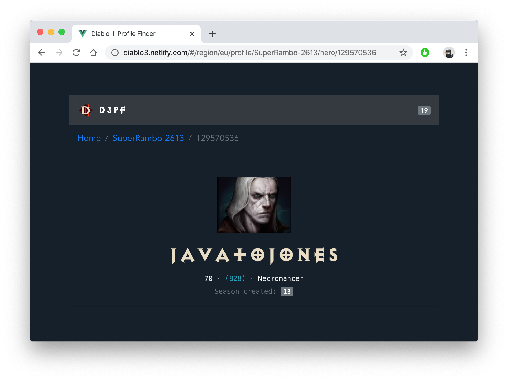

# Diablo 3 Profile Finder
<!-- ALL-CONTRIBUTORS-BADGE:START - Do not remove or modify this section -->
[](#contributors)
<!-- ALL-CONTRIBUTORS-BADGE:END -->
> 👾 D3PF. Vue.js course repository

[D3PF](https://diablo3-leonel.netlify.com/): Vue.js app created from scratch through [Vue CLI](https://cli.vuejs.org/) that consume official Diablo III APIs, a Blizzard's game.

## App Live Demo
👉 https://diablo3-leonel.netlify.com/

> - User: `SuperRambo#2613`
> - Region: `EU`

---

[](https://app.netlify.com/sites/diablo3-leonel/deploys)



---

## Project setup
```markdown
# Install
yarn install

# Compiles and hot-reloads for development
yarn serve

# Compiles and minifies for production
yarn build

# Run your unit tests
yarn test:unit

# Run your end-to-end tests
yarn test:e2e

# Lints and fixes files
yarn lint
```

---

## Author


### Leonel Rojas 🤘🏼
Web developer. Passionate about technology in general and web development in particular. 

- Github: https://github.com/leonelhrp
- Twitter: https://twitter.com/leonelhrp
- Dev: https://dev.to/leonelhrp